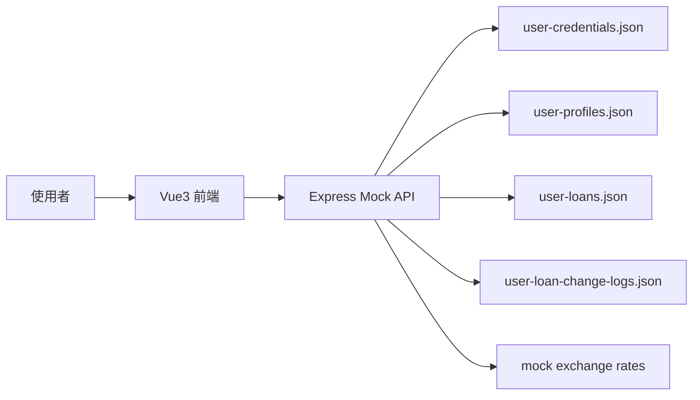
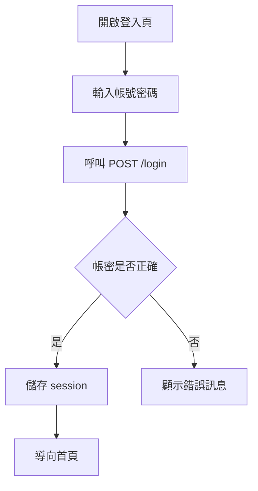
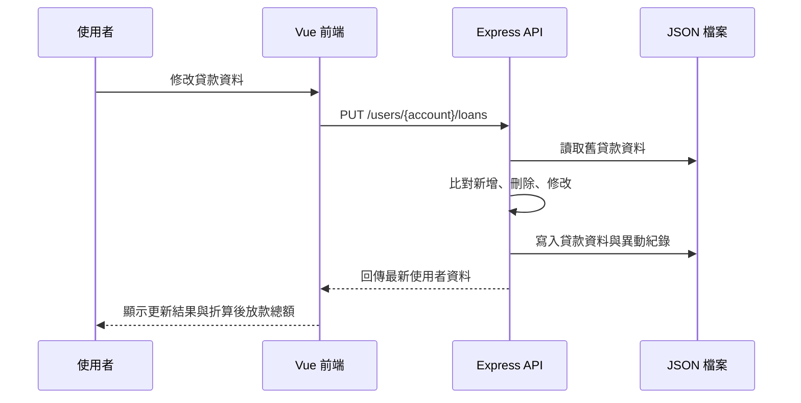

# 系統分析設計規格書

最後更新時間：2026/05/24 22:01:44

## 1. 版本記錄

| 版本 | 時間 | 更新內容 | 維護者 |
|---|---|---|---|
| 1.0 | 2026/05/23 01:19:00 | 建立登入與註冊示範功能 | Codex |
| 1.1 | 2026/05/23 02:41:00 | 新增 Express mock API 與 JSON 資料檔 | Codex |
| 1.2 | 2026/05/23 11:57:00 | 新增貸款資料維護與單元測試 | Codex |
| 1.3 | 2026/05/23 13:42:01 | 新增貸款異動紀錄與文件 | Codex |
| 1.4 | 2026/05/24 02:18:52 | 統一文件為 UTF-8 中文內容，mock 資料改為安全範例 | Codex |
| 1.5 | 2026/05/24 02:40:18 | 註冊頁新增使用者名稱輸入、長度檢核與 API 電文欄位 | Codex |
| 1.6 | 2026/05/24 02:53:00 | 補充註冊頁實際網頁操作驗證結果 | Codex |
| 2.0 | 2026/05/24 20:59:57 | 新增放款總額折算、目標幣別切換、匯率 mock API 與 reactive 狀態設計 | Codex |
| 2.1 | 2026/05/24 21:21:13 | 新增當前匯率資訊頁，支援本位幣下拉、匯率更新時間與各幣別匯率比值表格 | Codex |
| 2.2 | 2026/05/24 22:01:44 | 修正當前匯率資訊入口為另開新視窗或新分頁，讓使用者可保留原放款頁同步比對 | Codex |

## 2. 業務需求與系統範圍

本系統提供本機示範用的貸款資料管理流程，使用 Vue3 建立前端頁面，使用 Express 與 JSON 檔案模擬後端 API。

系統範圍包含：

- 使用者登入。
- 使用者註冊，註冊時由使用者自行輸入使用者名稱。
- 查詢使用者基本資料。
- 查詢貸款資料。
- 查詢模擬匯率並折算放款總額。
- 查看目前本位幣對應各幣別的匯率比值。
- 維護貸款資料。
- 產生與查詢貸款異動紀錄。
- 前端單元測試。

系統範圍不包含：

- 真實身分驗證。
- 真實資料庫。
- 真實個資或金融資料。
- 正式環境金流或核心銀行串接。

## 3. 業務流程

1. 使用者開啟登入頁。
2. 使用者輸入帳號與密碼。
3. 前端呼叫 `POST /login`。
4. Mock API 驗證 JSON 帳密。
5. 登入成功後，前端儲存 session 並導向首頁。
6. 首頁顯示使用者名稱、貸款資料、折算後放款總額與異動紀錄。
7. 使用者進入貸款維護頁，可新增、刪除或修改貸款資料。
8. 首頁與貸款維護頁呼叫 `GET /exchange-rates` 取得模擬匯率，依使用者選擇幣別折算總現欠金額與總還款金額。
9. 使用者點選「當前匯率資訊」會另開新視窗或新分頁進入匯率資訊頁，查看目前本位幣對各幣別的比值。
10. 前端呼叫 `PUT /users/{account}/loans` 儲存貸款資料。
11. Mock API 比對新舊貸款資料，產生新增、刪除或修改紀錄。
12. 使用者回首頁查看最新貸款資料、放款總額與異動紀錄。

## 4. 頁面功能規格

| 頁面 | 路由 | 功能 |
|---|---|---|
| 登入頁 | `/` | 輸入帳號密碼、呼叫登入 API、顯示錯誤訊息。 |
| 註冊頁 | `/register` | 輸入帳號、使用者名稱與密碼；使用者名稱需至少 2 個字元，註冊後導回首頁。 |
| 首頁 | `/home` | 顯示使用者資料、貸款清單、折算後放款總額、異動紀錄與功能入口。 |
| 貸款維護頁 | `/loans` | 新增、刪除、修改貸款資料並儲存，同步顯示可切換幣別的放款總額。 |
| 當前匯率資訊頁 | `/exchange-rates` | 顯示本位幣幣別下拉、匯率更新時間與各幣別匯率比值表格；直接進入時預設 TWD。 |

## 5. API 暨資料電文規格

### 5.1 POST `/login`

Request：

```json
{
  "account": "DEMO0001",
  "password": "DemoPass123!"
}
```

Response：

```json
{
  "success": true,
  "user": {
    "account": "DEMO0001",
    "userName": "示範使用者一",
    "loans": [],
    "loanChangeLogs": []
  }
}
```

### 5.2 POST `/register`

Request：

```json
{
  "account": "DEMO0003",
  "userName": "王小明",
  "password": "DemoPass789!"
}
```

Response：

```json
{
  "success": true,
  "user": {
    "account": "DEMO0003",
    "userName": "王小明",
    "loans": [],
    "loanChangeLogs": []
  }
}
```

欄位檢核：

- `account`：必填，長度需為 8 碼以上。
- `userName`：必填，長度需至少 2 個字元；不足時回傳 `使用者名稱必須大於2長`。
- `password`：必填，長度需為 8 碼以上。

### 5.3 GET `/users/{account}`

用途：查詢使用者基本資料、貸款資料與貸款異動紀錄。

### 5.4 PUT `/users/{account}/loans`

Request：

```json
{
  "loans": [
    {
      "loanAccount": "9000000000001",
      "currency": "TWD",
      "currentOutstandingAmount": 125000,
      "nextPaymentDate": "20260615",
      "nextPaymentAmount": 8500
    }
  ]
}
```

欄位檢核：

- `loanAccount`：必填，需剛好為 13 碼數字，且同一使用者放款資料不可重複。
- `currency`：必填，需為 3 碼英文幣別。
- `currentOutstandingAmount`：必填，需為數字。
- `nextPaymentDate`：必填，格式為 `yyyymmdd`。
- `nextPaymentAmount`：必填，需為數字，且當前現欠金額需大於等於下期還款金額。

### 5.5 GET `/users/{account}/loan-change-logs`

用途：查詢貸款異動紀錄，依異動時間由新到舊排序。

### 5.6 GET `/exchange-rates`

用途：模擬匯率查詢，提供首頁與貸款維護頁折算放款總額。回傳匯率以 `TWD` 為基準，前端會依每筆放款幣別折算到使用者選擇的目標幣別。

Response：

```json
{
  "success": true,
  "baseCurrency": "TWD",
  "updatedAt": "2026/05/24 20:59:57",
  "rates": {
    "TWD": 1,
    "USD": 32.15,
    "JPY": 0.214
  }
}
```

## 6. 驗收測試案例

| 編號 | 情境 | 步驟 | 預期結果 |
|---|---|---|---|
| AT-001 | 登入成功 | 使用 `DEMO0001` / `DemoPass123!` 登入 | 進入首頁並顯示使用者資料 |
| AT-002 | 登入失敗 | 輸入錯誤密碼 | 顯示登入失敗訊息 |
| AT-003 | 註冊成功 | 輸入 8 碼以上帳密與 2 個字元以上使用者名稱註冊 | 建立使用者，首頁顯示註冊時輸入的使用者名稱 |
| AT-004 | 使用者名稱驗證 | 註冊時輸入 1 個字元使用者名稱 | 顯示 `使用者名稱必須大於2長` 且不呼叫 API |
| AT-005 | 貸款欄位驗證 | 輸入少於 13 碼的貸款帳號 | 顯示欄位錯誤訊息 |
| AT-006 | 貸款更新 | 修改貸款金額並儲存 | 更新 JSON 資料並產生異動紀錄 |
| AT-007 | 異動紀錄查詢 | 更新後回首頁查看紀錄 | 顯示新增、刪除或修改紀錄 |
| AT-018 | 放款總額折算 | 首頁與貸款維護頁讀取匯率資料 | 顯示總現欠金額、總還款金額與目標幣別下拉選單 |
| AT-019 | 目標幣別切換 | 切換放款總額旁的幣別下拉選單 | 總額依匯率重新折算並更新顯示 |
| AT-020 | 匯率資訊頁 | 點選總額區「當前匯率資訊」 | 另開新視窗或新分頁進入 `/exchange-rates`，並帶入目前選擇的本位幣 |
| AT-021 | 匯率比值表 | 在匯率資訊頁切換本位幣 | 表格標題與各幣別比值依新本位幣重新計算 |

測試指令：

```bash
npm test
npm run build
```

實際網頁操作驗證：

- 開啟 `http://127.0.0.1:5173/register`。
- 確認註冊頁顯示帳號、使用者名稱、密碼與送出按鈕。
- 輸入 1 字元使用者名稱並送出，畫面顯示 `使用者名稱必須大於2長`。
- 輸入 2 字元以上使用者名稱並送出，註冊成功後導向 `/home`，首頁顯示註冊時輸入的使用者名稱。

## 7. 關聯圖、流程圖、循序圖

### 7.1 系統關聯圖



### 7.2 登入流程圖



### 7.3 貸款更新循序圖



## 1.7 版本記錄

| 版本 | 時間 | 更新摘要 | 維護者 |
|---|---|---|---|
| 1.7 | 2026/05/24 03:17:13 | 導入可擴充 Vue3 技術：Vuex session 狀態、props/emit 元件拆分、RouterLink 導覽、Home onMounted 刷新、vee-validate 註冊驗證、vue-next-select 幣別選單。 | Codex |

## 8. Vue3 重構設計補充

### 8.1 業務需求與系統範圍補充
本次重構不改變既有業務規格，主要改善系統可維護性：登入後使用者資料改由 Vuex 集中管理；註冊驗證改由 vee-validate 統一處理；放款編輯表格拆成元件，讓未來新增欄位、幣別資料來源或欄位驗證時更容易擴充。

### 8.2 頁面功能規格補充
| 頁面 | 補充規格 |
|---|---|
| 註冊頁 `/register` | 使用者名稱必填且需 2 長以上；不足時顯示「使用者名稱必須大於2長」；表單欄位由 `FormField.vue` props/emit 元件渲染。 |
| 首頁 `/home` | 頁面掛載後呼叫 `GET /users/{account}` 同步最新使用者資料；若使用者已登出，API 慢回應不得重新寫回 session。 |
| 放款更新頁 `/loans` | 放款列由 `LoanRowsEditor.vue` 管理畫面輸入；幣別欄位使用 `vue-next-select`，仍維持原存檔 payload 格式。 |

### 8.3 API 暨資料電文規格補充
`GET /users/{account}` 回傳資料會透過 `normalizeUser` 正規化為：
```json
{
  "account": "DEMO0001",
  "userName": "示範使用者",
  "loans": [],
  "loanChangeLogs": []
}
```

### 8.4 驗收測試案例補充
| 案例 | 驗收重點 | 結果 |
|---|---|---|
| AT-008 | 註冊頁使用 vee-validate 驗證空帳密、帳密長度、使用者名稱長度。 | 單元測試通過 |
| AT-009 | RouterLink 導覽可由登入頁到註冊頁、註冊頁回登入頁、首頁到放款更新頁。 | 單元測試通過 |
| AT-010 | 首頁 onMounted 刷新資料時，登出後不被慢回應覆蓋 session。 | 單元測試通過 |
| AT-011 | 放款更新頁新增列後可顯示 vue-next-select 幣別元件，並維持原 payload。 | 單元測試與瀏覽器實測通過 |

### 8.5 重構後關聯圖


## 1.8 版本記錄

| 版本 | 時間 | 更新摘要 | 維護者 |
|---|---|---|---|
| 1.8 | 2026/05/24 20:16:14 | 放款資訊更新頁新增 13 碼數字帳號、不可重複、當前現欠金額需大於等於下期還款金額等驗證規格。 | Codex |

## 9. 放款更新驗證規格補充

### 9.1 頁面功能規格
| 欄位 | 驗證規則 | 錯誤訊息 |
|---|---|---|
| 放款帳號 | 輸入時只保留數字且最多 13 碼；存檔時必須剛好 13 碼。 | `第 N 筆放款帳號需為 13 碼數字` |
| 放款帳號 | 同一批放款資料不可重複。 | `第 N 筆放款帳號不可重複` |
| 當前現欠金額 / 下期還款金額 | 當前現欠金額必須大於等於下期還款金額。 | `第 N 筆當前現欠金額必須大於等於下期還款金額` |

### 9.2 驗收測試案例
| 案例 | 驗收重點 | 結果 |
|---|---|---|
| AT-012 | 放款帳號輸入英文字與超過 13 碼時，畫面只保留前 13 碼數字。 | 單元測試通過 |
| AT-013 | 新增放款帳號不足 13 碼時不可存檔。 | 單元測試通過 |
| AT-014 | 新增放款帳號與既有放款帳號重複時不可存檔。 | 單元測試通過 |
| AT-015 | 當前現欠金額小於下期還款金額時不可存檔。 | 單元測試通過 |

## 2026/05/24 業主價值簡報補充

本專案新增 `Vue3放款服務平台_業主價值簡報.pdf` 作為業主溝通材料，並保留 `Vue3放款服務平台_業主價值簡報.html` 作為後續調整來源檔。簡報定位不是技術細節簡報，而是用商業語言說明系統價值：

1. Story：以放款資料維護流程中常見的資料不確定、格式不一致與修改不可追溯作為故事開場。
2. Surprise：凸顯目前系統已具備可操作的登入、註冊、會員資料查詢、放款維護、異動紀錄與 mock API 展示能力，並以操作流程簡圖、資料流簡圖說明前端、API 與資料層如何協作。
3. Service：提出試辦驗證、正式 API 串接、營運治理三階段導入方式，支援後續權限、審核、通知與稽核報表擴充。

此簡報可作為需求確認會議、試辦提案、階段性成果展示與後續擴充討論的共同溝通基準。

## 1.9 版本記錄

| 版本 | 時間 | 更新摘要 | 維護者 |
|---|---|---|---|
| 1.9 | 2026/05/24 20:40:19 | 修正放款資訊更新頁幣別下拉選單展開高度與層級，避免選項被表格裁切。 | Codex |

## 10. 幣別下拉選單 UI 規格補充

### 10.1 頁面功能規格
放款資訊更新頁的幣別欄位需能完整檢視與點選所有幣別選項。下拉選單展開時不得被表格外層裁切，並需具備足夠高度與可捲動能力。

### 10.2 驗收測試案例
| 案例 | 驗收重點 | 結果 |
|---|---|---|
| AT-016 | 點選放款資訊更新頁幣別欄位後，可看到 USD/TWD/JPY/SGD/EUR/GBP/AUD/CAD/CNY/HKD 選項。 | 瀏覽器實測通過 |
| AT-017 | 幣別下拉清單展開後不被表格裁切，且選項列有足夠點擊高度。 | 瀏覽器實測通過 |
