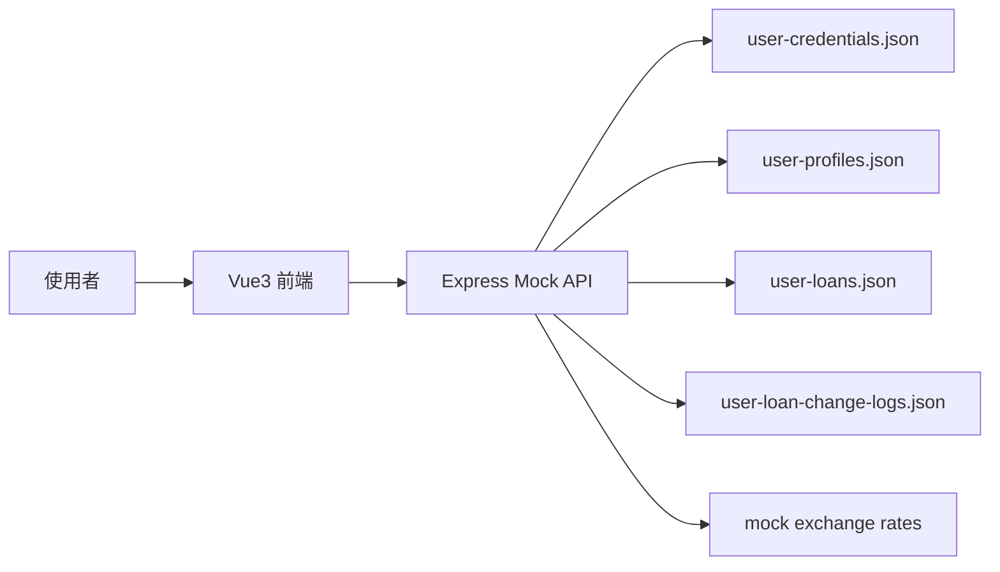
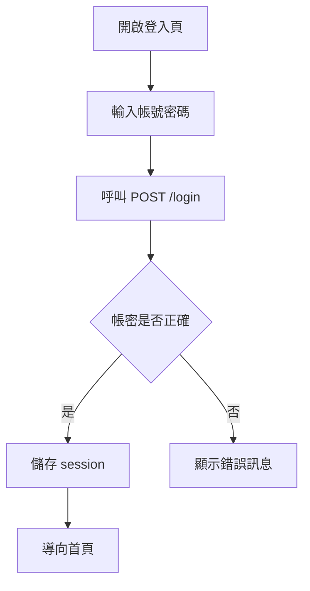
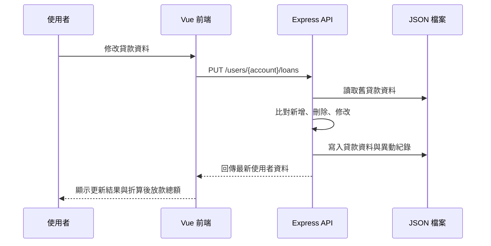
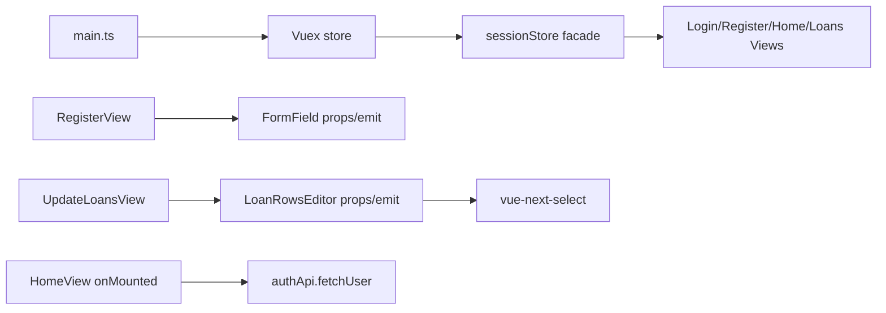

# 系統分析設計規格書

最後更新時間：2026/06/03 14:24:20

## 1. 版本記錄

| 版本 | 時間 | 更新內容 | 維護者 |
|---|---|---|---|
| 1.0 | 2026/05/23 01:19:00 | 建立登入與註冊示範功能 | Codex |
| 1.1 | 2026/05/23 02:41:00 | 新增 Express mock API 與 JSON 資料檔 | Codex |
| 1.2 | 2026/05/23 11:57:00 | 新增貸款資料維護與單元測試 | Codex |
| 1.3 | 2026/05/23 13:42:01 | 新增貸款異動紀錄與文件 | Codex |
| 1.4 | 2026/05/24 02:18:52 | 統一文件為 UTF-8 中文內容，mock 資料改為安全範例 | Codex |
| 1.5 | 2026/05/24 02:40:18 | 註冊頁新增使用者名稱輸入、長度檢核與 API 電文欄位 | Codex |
| 1.6 | 2026/05/24 02:53:00 | 補充註冊頁實際網頁操作驗證結果 | Codex |
| 2.0 | 2026/05/24 20:59:57 | 新增放款總額折算、目標幣別切換、匯率 mock API 與 reactive 狀態設計 | Codex |
| 2.1 | 2026/05/24 21:21:13 | 新增當前匯率資訊頁，支援本位幣下拉、匯率更新時間與各幣別匯率比值表格 | Codex |
| 2.2 | 2026/05/24 22:01:44 | 修正當前匯率資訊入口為另開新視窗或新分頁，讓使用者可保留原放款頁同步比對 | Codex |
| 2.3 | 2026/05/25 01:28:46 | 修正匯率資訊頁新視窗無原視窗 session 時被導走的問題，匯率資訊頁改為可直接開啟 | Codex |
| 2.4 | 2026/05/25 10:07:47 | 新增 API 連線模式 FLAG 與獨立後端 API 參數檔，支援 mock API 與實際後端 API 切換 | Codex |
| 2.5 | 2026/05/25 10:23:50 | 修正後端 API 模式未設定 URL 時 fallback mock 的問題，改為直接回報設定錯誤 | Codex |
| 2.6 | 2026/05/25 10:29:18 | 建立本機 `.env` 連接 `http://127.0.0.1:8080` 實際後端 API，完成端點與前端畫面驗證 | Codex |
| 2.7 | 2026/05/25 10:40:09 | 新增後台 API 狀態檢查頁 `/admin/api-health`，列出完整 URL、中文名稱與當前狀態 | Codex |
| 2.8 | 2026/05/25 10:59:33 | 補充實際後端 API 測試排查規範，明確說明 `npm run dev` 與 `npm run dev:full` 差異，避免多個前端/mock 行程造成誤判 | Codex |
| 2.9 | 2026/05/25 11:01:00 | 修正實際後端 API 排查規範，明確指出 mock API 3001 不會取代後端 API 8080，根因應聚焦多個 Vite 前端行程或舊環境設定 | Codex |
| 3.0 | 2026/05/25 11:10:52 | 強化後台 API 狀態檢查頁診斷資訊，新增 API 模式、Base URL、檢查時間與錯誤明細，並完成瀏覽器實測確認連線 8080 正常 | Codex |
| 3.1 | 2026/05/25 11:35:00 | 將 Vue3 核心前端程式、SFC script 與測試統一遷移為 TypeScript，新增 `vue-tsc` 型別檢查流程；mock server 維持 JavaScript | Codex |
| 3.2 | 2026/05/25 19:47:07 | 網頁名稱改為 `VUE3發票登入平台`，mock 模式顯示 `VUE3發票登入平台(mock)`；發票號碼相關中文字句統一調整 | Codex |
| 3.3 | 2026/05/25 20:05:00 | 補齊貸款異動紀錄查詢與寫入規格，明確定義異動紀錄產生時機、資料欄位與排序規則 | Codex |
| 3.4 | 2026/05/29 22:14:50 | 建立 API 自建模組分層，拆分 API 設定層、API Client 層與業務 API 層，並補強 TypeScript 型別與測試 | Codex |
| 3.5 | 2026/06/03 14:24:20 | 新增 Vue3 專案文件 SOP，明確定義專案建立、功能擴充、文件維護、測試驗證與版控檢查流程 | Codex |

## 2. 業務需求與系統範圍

本系統提供本機示範用的貸款資料管理流程，使用 Vue3 建立前端頁面，使用 Express 與 JSON 檔案模擬後端 API。

系統範圍包含：

- 使用者登入。
- 使用者註冊，註冊時由使用者自行輸入使用者名稱。
- 查詢使用者基本資料。
- 查詢貸款資料。
- 查詢模擬匯率並折算放款總額。
- 查看目前本位幣對應各幣別的匯率比值。
- 維護貸款資料。
- 產生與查詢貸款異動紀錄。
- 透過參數控制前端呼叫 mock API 或實際後端 API。
- 透過後台頁面檢查目前 API 端點是否正常。
- Vue3 核心前端程式採用 TypeScript，提升資料流、API 電文與元件 props/emit 的型別可維護性。
- API 呼叫採用自建模組分層，將 API 設定、HTTP Client 與業務 API 拆開，降低未來串接正式後端或移植到其他專案的成本。
- 依 API 連線模式顯示不同網頁名稱，避免使用者誤判目前操作環境。
- 透過 `VUE3專案文件SOP.md` 規範專案建立、功能擴充、測試、文件維護與版控檢查流程。
- 前端單元測試。

系統範圍不包含：

- 真實身分驗證。
- 真實資料庫。
- 真實個資或金融資料。
- 正式環境金流或核心銀行串接。

## 3. 業務流程

1. 使用者開啟登入頁。
2. 使用者輸入帳號與密碼。
3. 前端呼叫 `POST /login`。
4. Mock API 驗證 JSON 帳密。
5. 登入成功後，前端儲存 session 並導向首頁。
6. 首頁顯示使用者名稱、貸款資料、折算後放款總額與異動紀錄。
7. 使用者進入貸款維護頁，可新增、刪除或修改貸款資料。
8. 首頁與貸款維護頁呼叫 `GET /exchange-rates` 取得模擬匯率，依使用者選擇幣別折算總現欠金額與總還款金額。
9. 使用者點選「當前匯率資訊」會另開新視窗或新分頁進入匯率資訊頁，查看目前本位幣對各幣別的比值。
10. 前端呼叫 `PUT /users/{account}/loans` 儲存貸款資料。
11. Mock API 比對新舊貸款資料，產生新增、刪除或修改紀錄。
12. 使用者回首頁查看最新貸款資料、放款總額與異動紀錄。

## 4. 頁面功能規格

| 頁面 | 路由 | 功能 |
|---|---|---|
| 登入頁 | `/` | 輸入帳號密碼、呼叫登入 API、顯示錯誤訊息。 |
| 註冊頁 | `/register` | 輸入帳號、使用者名稱與密碼；使用者名稱需至少 2 個字元，註冊後導回首頁。 |
| 首頁 | `/home` | 顯示使用者資料、貸款清單、折算後放款總額、異動紀錄與功能入口。 |
| 貸款維護頁 | `/loans` | 新增、刪除、修改貸款資料並儲存，同步顯示可切換幣別的放款總額。 |
| 當前匯率資訊頁 | `/exchange-rates` | 顯示本位幣幣別下拉、匯率更新時間與各幣別匯率比值表格；直接進入時預設 TWD，且不依賴原視窗登入 session。 |
| 後台 API 狀態檢查頁 | `/admin/api-health` | 顯示 API 模式、Base URL、完整 URL、URL 中文名稱、當前狀態與錯誤明細，並可手動重新檢查 API。 |

## 5. API 暨資料電文規格

### 5.0 API 連線參數

前端 API 連線模式由 `.env` 控制：

| 參數 | 預設值 | 說明 |
|---|---|---|
| `VITE_USE_BACKEND_API` | `false` | `false` 呼叫本機 mock API；`true` 呼叫實際後端 API。 |
| `VITE_MOCK_API_BASE_URL` | `http://127.0.0.1:3001` | mock API base URL。 |
| `VITE_BACKEND_API_BASE_URL` | `https://api.example.com` | 實際後端 API base URL；`VITE_USE_BACKEND_API=true` 時必填。 |
| `VITE_API_TIMEOUT_MS` | `8000` | API 逾時毫秒數。 |

後端 API 的 method、URL 與動態路徑集中於 `src/api/config/backendApiConfig.ts`。前端呼叫 API 時，會由 API Client 層依 API 名稱解析端點設定，再交給業務 API 層正規化 response。若 `VITE_USE_BACKEND_API=true` 但未設定 `VITE_BACKEND_API_BASE_URL`，系統會回報設定錯誤，不可 fallback 回 mock API。

API 自建模組分層：

| 分層 | 檔案 | 規格說明 |
|---|---|---|
| API 設定層 | `src/api/config/backendApiConfig.ts` | 管理 API 模式、base URL、timeout、端點 method、URL、中文名稱與健康檢查設定。 |
| API Client 層 | `src/api/client/httpClient.ts` | 建立共用 Axios instance，統一 baseURL、headers 與 timeout。 |
| API Client 層 | `src/api/client/request.ts` | 依端點名稱執行 request，統一錯誤訊息、HTTP 狀態明細與 success 欄位檢查。 |
| 業務 API 層 | `src/api/modules/authApi.ts` | 封裝登入與註冊 API。 |
| 業務 API 層 | `src/api/modules/userApi.ts` | 封裝使用者資料查詢 API。 |
| 業務 API 層 | `src/api/modules/loanApi.ts` | 封裝發票放款資訊更新與異動紀錄查詢 API。 |
| 業務 API 層 | `src/api/modules/exchangeRateApi.ts` | 封裝匯率查詢 API。 |
| 業務 API 層 | `src/api/modules/apiHealthApi.ts` | 封裝後台 API 狀態檢查功能。 |
| 業務 API 層 | `src/api/modules/normalizers.ts` | 統一正規化使用者、發票放款與異動紀錄 response。 |
| 匯出入口 | `src/api/index.ts` | 對外集中匯出 API 設定、Client 與業務 API，方便其他專案引用。 |

相容設計：`src/config/backendApiConfig.ts`、`src/services/authApi.ts` 與 `src/services/apiHealthService.ts` 目前保留為 re-export，避免舊引用一次性失效；新功能應直接引用 `src/api` 自建模組。

本機實際後端 API 測試 URL 為 `http://127.0.0.1:8080`。2026/05/25 10:29:18 已直接測試 `GET /exchange-rates` 與 `POST /login` 可回應，並透過前端匯率資訊頁確認資料來源為後端 API。

實際後端 API 測試規範：

- `VITE_USE_BACKEND_API=true` 時，建議使用 `npm run dev` 只啟動前端，讓排查範圍單純集中在前端是否讀到最新 `.env` 與後端 8080 回應。
- 後端 API 為 `http://127.0.0.1:8080`，mock API 為 `http://127.0.0.1:3001`，兩者 port 不同；mock API 不會取代 8080 後端。
- 修改 `.env` 後必須停止並重啟 Vite，否則前端可能仍使用舊環境設定。
- 若後台檢查頁顯示 API 異常，但直接呼叫 `http://127.0.0.1:8080` 成功，應優先檢查是否存在多個 Vite 前端行程或瀏覽器載入舊 bundle，而非先判定後端 API 異常。

網頁名稱規則：

- `VITE_USE_BACKEND_API=true`：瀏覽器分頁標題顯示 `VUE3發票登入平台`。
- `VITE_USE_BACKEND_API=false`：瀏覽器分頁標題顯示 `VUE3發票登入平台(mock)`。

### 5.0.1 後台 API 狀態檢查

後台檢查頁路徑為 `/admin/api-health`，欄位如下：

| 欄位 | 說明 |
|---|---|
| API 模式 | 顯示目前前端讀到的 API 模式，例如 mock 或 backend。 |
| Base URL | 顯示目前前端實際使用的 API base URL，可用來確認是否已讀到 8080 後端設定。 |
| 逾時毫秒 | 顯示目前 API client timeout 設定。 |
| 檢查時間 | 顯示本次檢查時間，協助判斷頁面是否仍是舊 bundle 或舊檢查結果。 |
| 完整 URL | 依目前 mock/backend 模式與 API 參數檔組出的完整端點。 |
| URL 中文名稱 | 對應 API 業務名稱。 |
| 當前狀態 | 顯示正常、異常、檢查中或未檢查原因。 |
| 錯誤明細 | 顯示 HTTP 狀態、CORS/網路錯誤、逾時或前端設定錯誤等排查資訊。 |

為避免健康檢查造成資料異動，註冊 API 與放款資訊更新 API 僅列出完整 URL，不送出請求。

### 5.1 POST `/login`

Request：

```json
{
  "account": "DEMO0001",
  "password": "DemoPass123!"
}
```

Response：

```json
{
  "success": true,
  "user": {
    "account": "DEMO0001",
    "userName": "示範使用者一",
    "loans": [],
    "loanChangeLogs": []
  }
}
```

### 5.2 POST `/register`

Request：

```json
{
  "account": "DEMO0003",
  "userName": "王小明",
  "password": "DemoPass789!"
}
```

Response：

```json
{
  "success": true,
  "user": {
    "account": "DEMO0003",
    "userName": "王小明",
    "loans": [],
    "loanChangeLogs": []
  }
}
```

欄位檢核：

- `account`：必填，長度需為 8 碼以上。
- `userName`：必填，長度需至少 2 個字元；不足時回傳 `使用者名稱必須大於2長`。
- `password`：必填，長度需為 8 碼以上。

### 5.3 GET `/users/{account}`

用途：查詢使用者基本資料、貸款資料與貸款異動紀錄。

### 5.4 PUT `/users/{account}/loans`

用途：更新指定使用者的貸款資料。系統會先檢核貸款資料欄位，再比對存檔前後差異；若有新增、刪除或修改，會同步寫入貸款異動紀錄。

Request：

```json
{
  "loans": [
    {
      "loanAccount": "9000000000001",
      "currency": "TWD",
      "currentOutstandingAmount": 125000,
      "nextPaymentDate": "20260615",
      "nextPaymentAmount": 8500
    }
  ]
}
```

欄位檢核：

- `loanAccount`：必填，需剛好為 13 碼數字，且同一使用者放款資料不可重複。
- `currency`：必填，需為 3 碼英文幣別。
- `currentOutstandingAmount`：必填，需為數字。
- `nextPaymentDate`：必填，格式為 `yyyymmdd`。
- `nextPaymentAmount`：必填，需為數字，且當前現欠金額需大於等於下期還款金額。

Response：

```json
{
  "success": true,
  "user": {
    "account": "DEMO0001",
    "userName": "示範使用者",
    "loans": [
      {
        "loanAccount": "9000000000001",
        "currency": "TWD",
        "currentOutstandingAmount": 125000,
        "nextPaymentDate": "20260615",
        "nextPaymentAmount": 8500
      }
    ],
    "loanChangeLogs": [
      {
        "changedAt": "2026/05/25 20:05:00",
        "changedBy": "示範使用者",
        "changeItem": "修改",
        "changeData": [
          {
            "loanAccount": "9000000000001",
            "field": "nextPaymentAmount",
            "fieldName": "下期還款金額",
            "oldValue": 8000,
            "newValue": 8500
          }
        ]
      }
    ]
  }
}
```

寫入貸款異動紀錄規格：

- 寫入時機：僅在 `PUT /users/{account}/loans` 成功通過欄位檢核並完成貸款資料儲存時執行。
- 寫入檔案：mock 環境寫入 `server/user-loan-change-logs.json`；正式後端應寫入對應資料表或稽核紀錄儲存區。
- 異動人員：`changedBy` 使用 `user-profiles.json` 中該帳號的 `userName`；若找不到名稱，使用 `{account}使用者` 作為保底值。
- 異動時間：`changedAt` 使用寫入當下時間，格式為 `YYYY/MM/DD HH:MM:SS`。
- 排序規則：新產生的紀錄會與既有紀錄合併後，以 `changedAt` 由新到舊排序。
- 無異動處理：若新舊貸款資料完全一致，不新增異動紀錄；仍可回傳目前貸款資料與既有異動紀錄。
- 新增判斷：新貸款清單有、舊貸款清單沒有的 `loanAccount`，產生 `changeItem: "新增"`。
- 刪除判斷：舊貸款清單有、新貸款清單沒有的 `loanAccount`，產生 `changeItem: "刪除"`。
- 修改判斷：新舊貸款清單都有相同 `loanAccount`，但任一欄位值不同時，產生 `changeItem: "修改"`。
- 多欄位修改：同一筆貸款若多個欄位同時異動，集中寫在同一筆 `changeData` 陣列中，不拆成多筆異動紀錄。
- 新增與刪除的 `changeData`：需完整列出該筆貸款的所有欄位；新增只寫 `newValue`，刪除只寫 `oldValue`。
- 修改的 `changeData`：只列出有變更的欄位，且需同時寫入 `oldValue` 與 `newValue`。
- 欄位中文名稱：`loanAccount` 對外顯示為 `發票號碼`；其他欄位依畫面中文欄位名稱寫入。

異動紀錄欄位說明：

| 欄位 | 型別 | 說明 |
|---|---|---|
| `changedAt` | string | 異動時間，格式 `YYYY/MM/DD HH:MM:SS`。 |
| `changedBy` | string | 異動人員名稱。 |
| `changeItem` | string | 異動類型，可為 `新增`、`刪除`、`修改`。 |
| `changeData` | array | 異動欄位明細陣列。 |
| `changeData[].loanAccount` | string | 發票號碼，保留 API 欄位名稱 `loanAccount` 以維持資料契約。 |
| `changeData[].field` | string | 異動欄位英文代碼。 |
| `changeData[].fieldName` | string | 異動欄位中文名稱。 |
| `changeData[].oldValue` | string/number | 修改前或刪除前資料；新增紀錄可不提供。 |
| `changeData[].newValue` | string/number | 修改後或新增後資料；刪除紀錄可不提供。 |

### 5.5 GET `/users/{account}/loan-change-logs`

用途：查詢貸款異動紀錄，依異動時間由新到舊排序。

Request path 參數：

| 參數 | 說明 |
|---|---|
| `account` | 使用者帳號。 |

Response：

```json
{
  "success": true,
  "account": "DEMO0001",
  "loanChangeLogs": [
    {
      "changedAt": "2026/05/25 20:05:00",
      "changedBy": "示範使用者",
      "changeItem": "修改",
      "changeData": [
        {
          "loanAccount": "9000000000001",
          "field": "nextPaymentAmount",
          "fieldName": "下期還款金額",
          "oldValue": 8000,
          "newValue": 8500
        }
      ]
    }
  ]
}
```

查詢規格：

- 查無使用者時回傳 `404`，Response body 為 `{ "success": false, "message": "查無使用者" }`。
- 若使用者存在但尚無異動紀錄，回傳 `success: true` 且 `loanChangeLogs: []`。
- 查詢結果只負責讀取，不得新增、修改或刪除異動紀錄。
- 回傳順序必須依 `changedAt` 由新到舊排序，方便首頁優先顯示最新異動。
- 首頁 `/home` 也可透過 `GET /users/{account}` 取得同一份 `loanChangeLogs`，但若只需要異動紀錄，應呼叫本 API 降低回傳資料量。

### 5.6 GET `/exchange-rates`

用途：模擬匯率查詢，提供首頁與貸款維護頁折算放款總額。回傳匯率以 `TWD` 為基準，前端會依每筆放款幣別折算到使用者選擇的目標幣別。

Response：

```json
{
  "success": true,
  "baseCurrency": "TWD",
  "updatedAt": "2026/05/24 20:59:57",
  "rates": {
    "TWD": 1,
    "USD": 32.15,
    "JPY": 0.214
  }
}
```

## 6. 驗收測試案例

| 編號 | 情境 | 步驟 | 預期結果 |
|---|---|---|---|
| AT-001 | 登入成功 | 使用 `DEMO0001` / `DemoPass123!` 登入 | 進入首頁並顯示使用者資料 |
| AT-002 | 登入失敗 | 輸入錯誤密碼 | 顯示登入失敗訊息 |
| AT-003 | 註冊成功 | 輸入 8 碼以上帳密與 2 個字元以上使用者名稱註冊 | 建立使用者，首頁顯示註冊時輸入的使用者名稱 |
| AT-004 | 使用者名稱驗證 | 註冊時輸入 1 個字元使用者名稱 | 顯示 `使用者名稱必須大於2長` 且不呼叫 API |
| AT-005 | 貸款欄位驗證 | 輸入少於 13 碼的發票號碼 | 顯示欄位錯誤訊息 |
| AT-006 | 貸款更新 | 修改貸款金額並儲存 | 更新 JSON 資料並產生異動紀錄 |
| AT-007 | 異動紀錄查詢 | 更新後回首頁查看紀錄 | 顯示新增、刪除或修改紀錄 |
| AT-018 | 放款總額折算 | 首頁與貸款維護頁讀取匯率資料 | 顯示總現欠金額、總還款金額與目標幣別下拉選單 |
| AT-019 | 目標幣別切換 | 切換放款總額旁的幣別下拉選單 | 總額依匯率重新折算並更新顯示 |
| AT-020 | 匯率資訊頁 | 點選總額區「當前匯率資訊」 | 另開新視窗或新分頁進入 `/exchange-rates`，並帶入目前選擇的本位幣 |
| AT-021 | 匯率比值表 | 在匯率資訊頁切換本位幣 | 表格標題與各幣別比值依新本位幣重新計算 |
| AT-022 | 匯率頁新視窗路由 | 在沒有原視窗 Vuex session 的新視窗直接開啟 `/exchange-rates` | 停留在當前匯率資訊頁，不導回首頁或登入頁 |
| AT-023 | 後台 API 狀態檢查 | 直接開啟 `/admin/api-health` | 顯示 API 模式、Base URL、完整 URL、URL 中文名稱、當前狀態與錯誤明細；安全端點自動檢查，異動端點不送出 |
| AT-024 | API 自建模組重構 | 執行 TypeScript 型別檢查、單元測試與 production build | API 設定層、API Client 層、業務 API 層皆可正常編譯並維持既有功能 |

測試指令：

```bash
npm test
npm run type-check
npm run build
```

2026/05/29 22:14:50 驗證結果：

- `npm run type-check`：通過。
- `npm test`：9 個測試檔、37 個測試案例通過。
- `npm run build`：`vue-tsc --noEmit` 與 Vite production build 成功。

實際網頁操作驗證：

- 開啟 `http://127.0.0.1:5173/register`。
- 確認註冊頁顯示帳號、使用者名稱、密碼與送出按鈕。
- 輸入 1 字元使用者名稱並送出，畫面顯示 `使用者名稱必須大於2長`。
- 輸入 2 字元以上使用者名稱並送出，註冊成功後導向 `/home`，首頁顯示註冊時輸入的使用者名稱。

## 7. 關聯圖、流程圖、循序圖

### 7.1 系統關聯圖



### 7.2 登入流程圖



### 7.3 貸款更新循序圖



## 1.7 版本記錄

| 版本 | 時間 | 更新摘要 | 維護者 |
|---|---|---|---|
| 1.7 | 2026/05/24 03:17:13 | 導入可擴充 Vue3 技術：Vuex session 狀態、props/emit 元件拆分、RouterLink 導覽、Home onMounted 刷新、vee-validate 註冊驗證、vue-next-select 幣別選單。 | Codex |

## 8. Vue3 重構設計補充

### 8.1 業務需求與系統範圍補充
本次重構不改變既有業務規格，主要改善系統可維護性：登入後使用者資料改由 Vuex 集中管理；註冊驗證改由 vee-validate 統一處理；放款編輯表格拆成元件，讓未來新增欄位、幣別資料來源或欄位驗證時更容易擴充。

### 8.2 頁面功能規格補充
| 頁面 | 補充規格 |
|---|---|
| 註冊頁 `/register` | 使用者名稱必填且需 2 長以上；不足時顯示「使用者名稱必須大於2長」；表單欄位由 `FormField.vue` props/emit 元件渲染。 |
| 首頁 `/home` | 頁面掛載後呼叫 `GET /users/{account}` 同步最新使用者資料；若使用者已登出，API 慢回應不得重新寫回 session。 |
| 放款更新頁 `/loans` | 放款列由 `LoanRowsEditor.vue` 管理畫面輸入；幣別欄位使用 `vue-next-select`，仍維持原存檔 payload 格式。 |

### 8.3 API 暨資料電文規格補充
`GET /users/{account}` 回傳資料會透過 `normalizeUser` 正規化為：
```json
{
  "account": "DEMO0001",
  "userName": "示範使用者",
  "loans": [],
  "loanChangeLogs": []
}
```

### 8.4 驗收測試案例補充
| 案例 | 驗收重點 | 結果 |
|---|---|---|
| AT-008 | 註冊頁使用 vee-validate 驗證空帳密、帳密長度、使用者名稱長度。 | 單元測試通過 |
| AT-009 | RouterLink 導覽可由登入頁到註冊頁、註冊頁回登入頁、首頁到放款更新頁。 | 單元測試通過 |
| AT-010 | 首頁 onMounted 刷新資料時，登出後不被慢回應覆蓋 session。 | 單元測試通過 |
| AT-011 | 放款更新頁新增列後可顯示 vue-next-select 幣別元件，並維持原 payload。 | 單元測試與瀏覽器實測通過 |

### 8.5 重構後關聯圖


## 1.8 版本記錄

| 版本 | 時間 | 更新摘要 | 維護者 |
|---|---|---|---|
| 1.8 | 2026/05/24 20:16:14 | 放款資訊更新頁新增 13 碼數字帳號、不可重複、當前現欠金額需大於等於下期還款金額等驗證規格。 | Codex |

## 9. 放款更新驗證規格補充

### 9.1 頁面功能規格
| 欄位 | 驗證規則 | 錯誤訊息 |
|---|---|---|
| 發票號碼 | 輸入時只保留數字且最多 13 碼；存檔時必須剛好 13 碼。 | `第 N 筆發票號碼需為 13 碼數字` |
| 發票號碼 | 同一批放款資料不可重複。 | `第 N 筆發票號碼不可重複` |
| 當前現欠金額 / 下期還款金額 | 當前現欠金額必須大於等於下期還款金額。 | `第 N 筆當前現欠金額必須大於等於下期還款金額` |

### 9.2 驗收測試案例
| 案例 | 驗收重點 | 結果 |
|---|---|---|
| AT-012 | 發票號碼輸入英文字與超過 13 碼時，畫面只保留前 13 碼數字。 | 單元測試通過 |
| AT-013 | 新增發票號碼不足 13 碼時不可存檔。 | 單元測試通過 |
| AT-014 | 新增發票號碼與既有發票號碼重複時不可存檔。 | 單元測試通過 |
| AT-015 | 當前現欠金額小於下期還款金額時不可存檔。 | 單元測試通過 |

## 2026/05/24 業主價值簡報補充

本專案新增 `Vue3放款服務平台_業主價值簡報.pdf` 作為業主溝通材料，並保留 `Vue3放款服務平台_業主價值簡報.html` 作為後續調整來源檔。簡報定位不是技術細節簡報，而是用商業語言說明系統價值：

1. Story：以放款資料維護流程中常見的資料不確定、格式不一致與修改不可追溯作為故事開場。
2. Surprise：凸顯目前系統已具備可操作的登入、註冊、會員資料查詢、放款維護、異動紀錄與 mock API 展示能力，並以操作流程簡圖、資料流簡圖說明前端、API 與資料層如何協作。
3. Service：提出試辦驗證、正式 API 串接、營運治理三階段導入方式，支援後續權限、審核、通知與稽核報表擴充。

此簡報可作為需求確認會議、試辦提案、階段性成果展示與後續擴充討論的共同溝通基準。

## 1.9 版本記錄

| 版本 | 時間 | 更新摘要 | 維護者 |
|---|---|---|---|
| 1.9 | 2026/05/24 20:40:19 | 修正放款資訊更新頁幣別下拉選單展開高度與層級，避免選項被表格裁切。 | Codex |

## 10. 幣別下拉選單 UI 規格補充

### 10.1 頁面功能規格
放款資訊更新頁的幣別欄位需能完整檢視與點選所有幣別選項。下拉選單展開時不得被表格外層裁切，並需具備足夠高度與可捲動能力。

### 10.2 驗收測試案例
| 案例 | 驗收重點 | 結果 |
|---|---|---|
| AT-016 | 點選放款資訊更新頁幣別欄位後，可看到 USD/TWD/JPY/SGD/EUR/GBP/AUD/CAD/CNY/HKD 選項。 | 瀏覽器實測通過 |
| AT-017 | 幣別下拉清單展開後不被表格裁切，且選項列有足夠點擊高度。 | 瀏覽器實測通過 |


