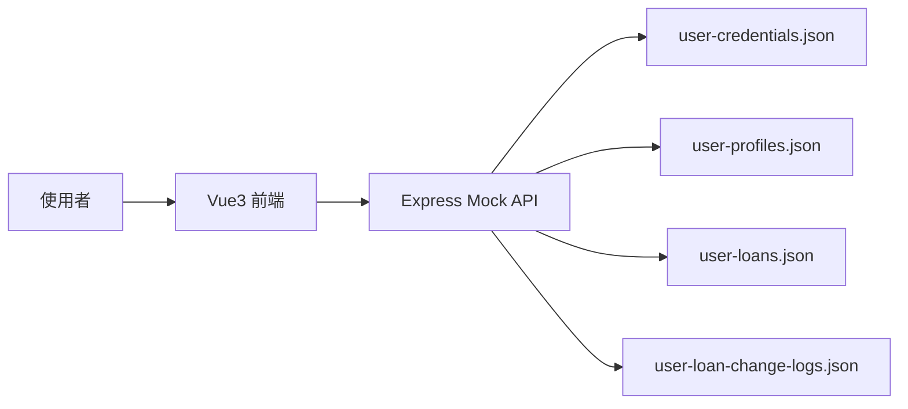
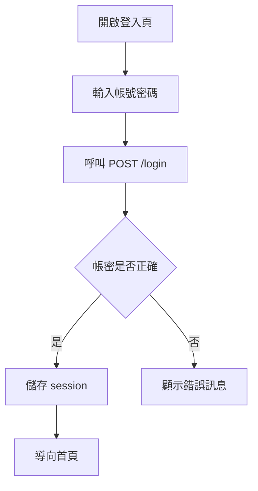
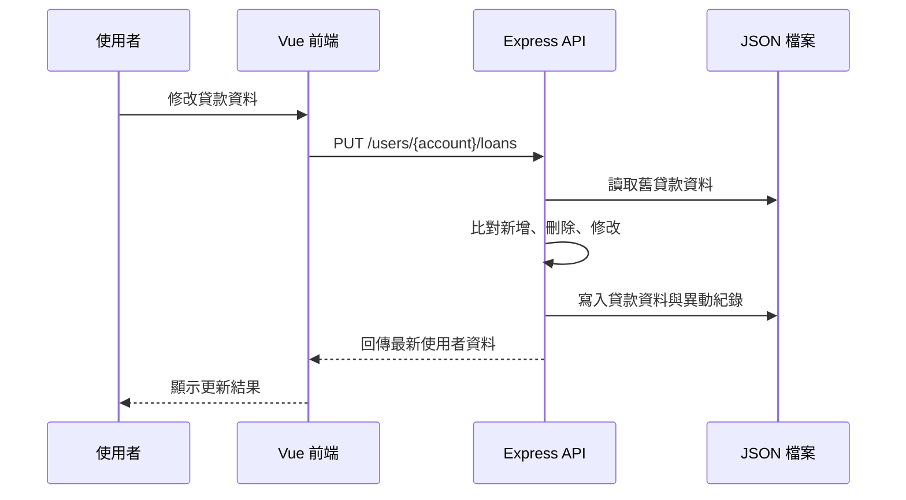

# 系統分析設計規格書

最後更新時間：2026/05/24 02:53:00

## 1. 版本記錄

| 版本 | 時間 | 更新內容 | 維護者 |
|---|---|---|---|
| 1.0 | 2026/05/23 01:19:00 | 建立登入與註冊示範功能 | Codex |
| 1.1 | 2026/05/23 02:41:00 | 新增 Express mock API 與 JSON 資料檔 | Codex |
| 1.2 | 2026/05/23 11:57:00 | 新增貸款資料維護與單元測試 | Codex |
| 1.3 | 2026/05/23 13:42:01 | 新增貸款異動紀錄與文件 | Codex |
| 1.4 | 2026/05/24 02:18:52 | 統一文件為 UTF-8 中文內容，mock 資料改為安全範例 | Codex |
| 1.5 | 2026/05/24 02:40:18 | 註冊頁新增使用者名稱輸入、長度檢核與 API 電文欄位 | Codex |
| 1.6 | 2026/05/24 02:53:00 | 補充註冊頁實際網頁操作驗證結果 | Codex |

## 2. 業務需求與系統範圍

本系統提供本機示範用的貸款資料管理流程，使用 Vue3 建立前端頁面，使用 Express 與 JSON 檔案模擬後端 API。

系統範圍包含：

- 使用者登入。
- 使用者註冊，註冊時由使用者自行輸入使用者名稱。
- 查詢使用者基本資料。
- 查詢貸款資料。
- 維護貸款資料。
- 產生與查詢貸款異動紀錄。
- 前端單元測試。

系統範圍不包含：

- 真實身分驗證。
- 真實資料庫。
- 真實個資或金融資料。
- 正式環境金流或核心銀行串接。

## 3. 業務流程

1. 使用者開啟登入頁。
2. 使用者輸入帳號與密碼。
3. 前端呼叫 `POST /login`。
4. Mock API 驗證 JSON 帳密。
5. 登入成功後，前端儲存 session 並導向首頁。
6. 首頁顯示使用者名稱、貸款資料與異動紀錄。
7. 使用者進入貸款維護頁，可新增、刪除或修改貸款資料。
8. 前端呼叫 `PUT /users/{account}/loans` 儲存貸款資料。
9. Mock API 比對新舊貸款資料，產生新增、刪除或修改紀錄。
10. 使用者回首頁查看最新貸款資料與異動紀錄。

## 4. 頁面功能規格

| 頁面 | 路由 | 功能 |
|---|---|---|
| 登入頁 | `/` | 輸入帳號密碼、呼叫登入 API、顯示錯誤訊息。 |
| 註冊頁 | `/register` | 輸入帳號、使用者名稱與密碼；使用者名稱需至少 2 個字元，註冊後導回首頁。 |
| 首頁 | `/home` | 顯示使用者資料、貸款清單、異動紀錄與功能入口。 |
| 貸款維護頁 | `/loans` | 新增、刪除、修改貸款資料並儲存。 |

## 5. API 暨資料電文規格

### 5.1 POST `/login`

Request：

```json
{
  "account": "DEMO0001",
  "password": "DemoPass123!"
}
```

Response：

```json
{
  "success": true,
  "user": {
    "account": "DEMO0001",
    "userName": "示範使用者一",
    "loans": [],
    "loanChangeLogs": []
  }
}
```

### 5.2 POST `/register`

Request：

```json
{
  "account": "DEMO0003",
  "userName": "王小明",
  "password": "DemoPass789!"
}
```

Response：

```json
{
  "success": true,
  "user": {
    "account": "DEMO0003",
    "userName": "王小明",
    "loans": [],
    "loanChangeLogs": []
  }
}
```

欄位檢核：

- `account`：必填，長度需為 8 碼以上。
- `userName`：必填，長度需至少 2 個字元；不足時回傳 `使用者名稱必須大於2長`。
- `password`：必填，長度需為 8 碼以上。

### 5.3 GET `/users/{account}`

用途：查詢使用者基本資料、貸款資料與貸款異動紀錄。

### 5.4 PUT `/users/{account}/loans`

Request：

```json
{
  "loans": [
    {
      "loanAccount": "9000000000001",
      "currency": "TWD",
      "currentOutstandingAmount": 125000,
      "nextPaymentDate": "20260615",
      "nextPaymentAmount": 8500
    }
  ]
}
```

欄位檢核：

- `loanAccount`：必填，需為 13 碼以上數字。
- `currency`：必填，需為 3 碼英文幣別。
- `currentOutstandingAmount`：必填，需為數字。
- `nextPaymentDate`：必填，格式為 `yyyymmdd`。
- `nextPaymentAmount`：必填，需為數字。

### 5.5 GET `/users/{account}/loan-change-logs`

用途：查詢貸款異動紀錄，依異動時間由新到舊排序。

## 6. 驗收測試案例

| 編號 | 情境 | 步驟 | 預期結果 |
|---|---|---|---|
| AT-001 | 登入成功 | 使用 `DEMO0001` / `DemoPass123!` 登入 | 進入首頁並顯示使用者資料 |
| AT-002 | 登入失敗 | 輸入錯誤密碼 | 顯示登入失敗訊息 |
| AT-003 | 註冊成功 | 輸入 8 碼以上帳密與 2 個字元以上使用者名稱註冊 | 建立使用者，首頁顯示註冊時輸入的使用者名稱 |
| AT-004 | 使用者名稱驗證 | 註冊時輸入 1 個字元使用者名稱 | 顯示 `使用者名稱必須大於2長` 且不呼叫 API |
| AT-005 | 貸款欄位驗證 | 輸入少於 13 碼的貸款帳號 | 顯示欄位錯誤訊息 |
| AT-006 | 貸款更新 | 修改貸款金額並儲存 | 更新 JSON 資料並產生異動紀錄 |
| AT-007 | 異動紀錄查詢 | 更新後回首頁查看紀錄 | 顯示新增、刪除或修改紀錄 |

測試指令：

```bash
npm test
npm run build
```

實際網頁操作驗證：

- 開啟 `http://127.0.0.1:5173/register`。
- 確認註冊頁顯示帳號、使用者名稱、密碼與送出按鈕。
- 輸入 1 字元使用者名稱並送出，畫面顯示 `使用者名稱必須大於2長`。
- 輸入 2 字元以上使用者名稱並送出，註冊成功後導向 `/home`，首頁顯示註冊時輸入的使用者名稱。

## 7. 關聯圖、流程圖、循序圖

### 7.1 系統關聯圖



### 7.2 登入流程圖



### 7.3 貸款更新循序圖


